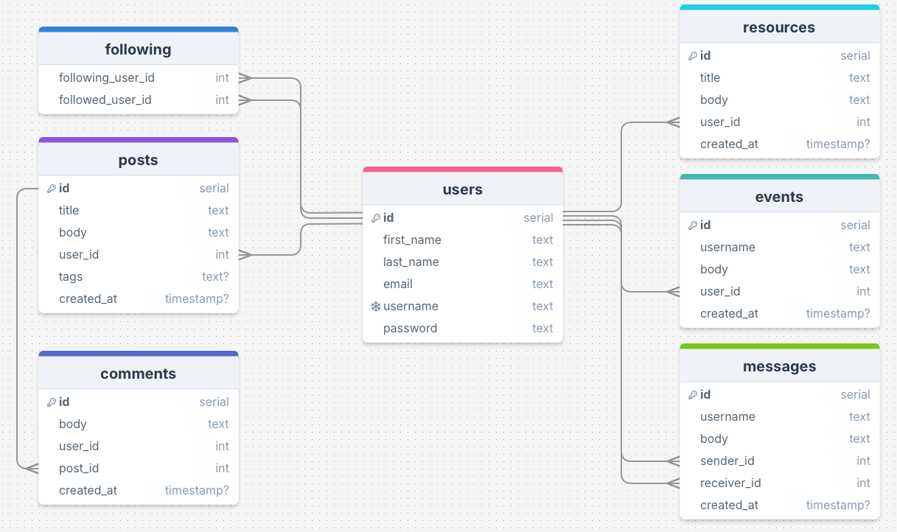

# LightHaven
Team:
- Nancy Quinonez
    - Events and Community Resource Page
- Ilyass Oudli
    - Posts and Comments
- Lyla Lynn
    - Users and Following

We worked on these tables from the back-end all the way to the front-end to make sure our databases and front-end interface remained consistent. The messages table is a stretch goal that we setup if we get through our CORE goals.

## Project Idea
We wanted to build a website that focuses on inclusivity and the LGBTQIA+ community. We want users to be able to come together to find community resources, post about anything from hobbies, to looking for help, to a funny story! Users will also be able to comment on others' posts and create new events and resources.

### CORE Features:
- Users can read community posts.
- Logged-in users can create new community posts and comment on other posts.
- Events page
- Community resource board/page

### Schema:

### API Endpoints:

